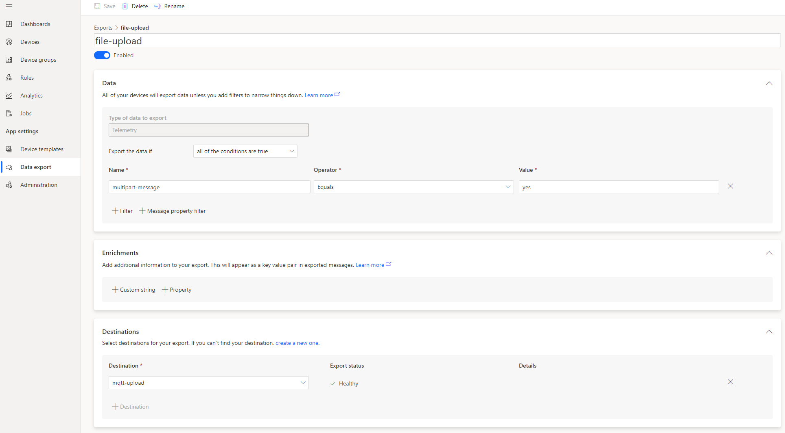
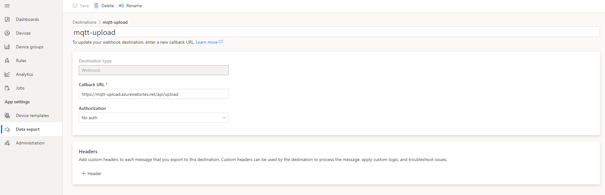
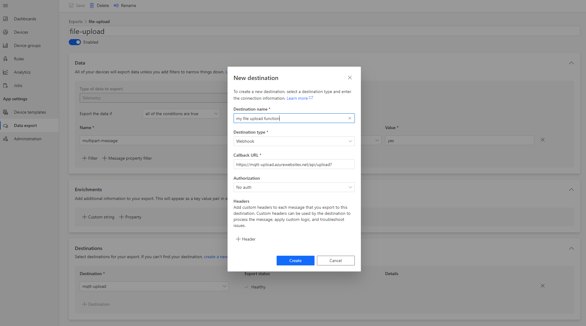
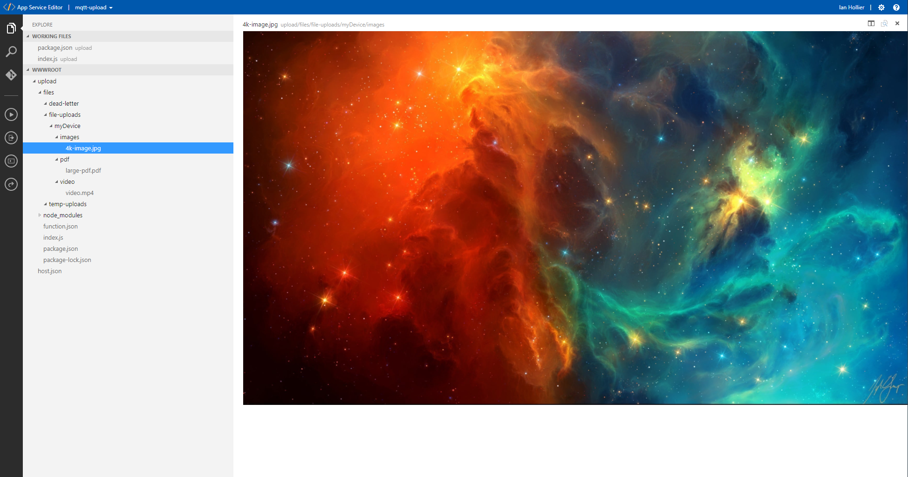

# iotc-file-transfer

## Description

Many devices need to push large payloads up to IoT Central and this has typically been achieved by using the File Upload feature in IoT Central that is backed by the "File Upload" feature in IoT Hub.  This works by configuring an Azure BLOB Storage container with IoT Central then using the Azure IoT device SDK to get a key to that container allowing the device to open an HTTPS connection to the BLOB storage container and pushing up the large payload.  Whilst this is an effective and secure way to push large payloads it does require the device to open a second secure connection to the Azure cloud something that can be a challenge for constrained devices.

This sample shows how you can push large payloads up to IoT central using the standard IoT transports (MQTT, AMQP, HTTPS) and without the need to open a second connection.  Using the IoT Central Continuous Data Export (CDE) feature and a simple Azure function it is possible to push very large payloads up to Azure.

## How it works

### From the device side
The device connects to IoT Central just as it would to send regular telemetry.  This can be via the standard transports of MQTT, AMQP, or HTTPS.  We recommend using MQTT for devices as it provides access to all the communication features of IoT Central.  Once connected the device can send telemetry and properties as normal.  When a large payload needs to be transmitted to IoT Central it is chunked into smaller payloads of 255KB and custom message properties are applid to the payloads indicating the file properties.

The message structure is as follows:

Payload - The payload has a maximum size of 255KB and is of type String.  It is defined in DTDLv2 as:

```
  {
    "@context": [
      "dtmi:iotcentral:context;2",
      "dtmi:dtdl:context;2"
    ],
    "@id": "dtmi:sample:multipartTransfer;1",
    "@type": [
      "Interface",
      "NamedInterface"
    ],
    "contents": [
      {
        "@id": "dtmi:sample:multipartTransfer:data;1",
        "@type": "Telemetry",
        "displayName": {
          "en": "data"
        },
        "name": "data",
        "schema": "string"
      }
    ],
    "displayName": {
      "en": "MultipartTransfer"
    },
    "name": "multipartTransfer"
  }
  ```

The custom message properties are as follows (all properties are required):

|Custom Property|Value example|Description|
|---------------|-------------|-----------|
|multipart-message|yes|signifies a large payload that is multi-part and should always have a value of yes|
|id|96a67e1d-662c-43fb-9440-ddcb29d9b817|a UUID4 identifier for the set of parts in this upload|
|filepath|device123\image\pic.jpg|the file name and path for the file when saved in the cloud.  The path will be appended to the base path in the cloud|
|part|1|the part number of the chunk
|maxPart|5|the maximum number of chunks in the upload
|compression|deflate|is the payload compressed and what is the compression algorithm.  Supported values are: none | deflate

Standard message properties are as follows:

|Standard Property|Value example|Description|
|---------------|-------------|-----------|
|content_type|application/json|describes the content type of the payload.  For now only application/json is supported.  Later releases might see binary format supported with content type application/octet-stream|
|content_encoding|utf-8|describes the encoding schema for the payload data.  For now only utf-8 is supported.  Later releases might see binary format supported in that case this property is not required|

Because the payload might contain binary data the payload should be converted to a base64 string.  This step is done after the optional step of compression.  The processing flow is as follows:

<ol>
<li> Compress the large data payload to be sent (optional) </li>
<li> Base64 convert the data from step 1 </li>
<li> Chunk the data from step 2 into 255KB parts </li>
<li> Form an Azure IoT message payload from each chunk and apply the necessary standard and custom properties appropriatly </li>
<li> Send the message to Azure IoT central </li>
<li> Repeat steps 4 and 5 until all the chunks have been sent </li>
</ol>

Once the final chunk has been sent you can optionally send a confirmation message to IoT Cnetral indicating that a large payload has been sent.  The format of this message is defined using this DTDLv2 interface:

```
  {
    "@context": [
      "dtmi:iotcentral:context;2",
      "dtmi:dtdl:context;2"
    ],
    "@id": "dtmi:sample:fileTransferStatus;1",
    "@type": [
      "Interface",
      "NamedInterface"
    ],
    "contents": [
      {
        "@id": "dtmi:sample:fileTransferStatus:filename;1",
        "@type": "Telemetry",
        "displayName": {
          "en": "File name"
        },
        "name": "filename",
        "schema": "string"
      },
      {
        "@id": "dtmi:sample:fileTransferStatus:filepath;1",
        "@type": "Telemetry",
        "displayName": {
          "en": "File path"
        },
        "name": "filepath",
        "schema": "string"
      },
      {
        "@id": "dtmi:sample:fileTransferStatus:status;1",
        "@type": "Telemetry",
        "displayName": {
          "en": "Status"
        },
        "name": "status",
        "schema": "integer"
      },
      {
        "@id": "dtmi:sample:fileTransferStatus:message;1",
        "@type": "Telemetry",
        "displayName": {
          "en": "Status message"
        },
        "name": "message",
        "schema": "string"
      },
      {
        "@id": "dtmi:sample:fileTransferStatus:size;1",
        "@type": "Telemetry",
        "displayName": {
          "en": "Size (KB)"
        },
        "name": "size",
        "schema": "double"
      }
    ],
    "displayName": {
      "en": "File Transfer Status"
    },
    "name": "fileTtransferStatus"
  }
```

|Custom Property|Description|
|---------------|-------------|
|filename|description of what was sent, either a file name or payload description|
|filepath|the path where the file was placed in the cloud|
|status|a status code indicating sucess or failure (uses standard HTTP status codes)|
|message|a custom status message describing the success or error|
|size|the size of the payload data sent (prior to compression or base64 encoding)|

An example of the payload would look like this:

```
    "fileTtransferStatus": {
        "filename": "./sample-upload-files/4k-image.jpg",
        "filepath": "myDevice/images/4k-image.jpg",
        "status": 200,
        "message": "completed",
        "size": 3913.5166015625
    }
```

### From the cloud side

The payloads marked with the custom message property of multipart-message=yes are handled using IoT centrals Continuous Data Export (CDE) feature.  By creating a CDE export that filters on the message property 'multipart-message' equals 'yes' all payloads matching this will be actioned by this data export.



The payloads should be sent to an Azure Function for processing.  This can be done by using a destination type of webhook and pointing the webhook URL towards the Azure function that contains an HTTP Trigger function.



The HTTP Trigger Azure Function should process the files at a minimum as follows for each incoming payload chunk:

<ol>
<li> Save the file payload to a file with a file name of the custom message property 'id' value and an extension of the custom message property 'part' value.</li>
<li> Count the number of files saved to see if they match the number in the custom message property 'maxPart'.  If they do then process the set as shown in the next section.</li>
</ol>

Once all the parts have been received the following processing should be done:

<ol>
<li> Concatenate the file parts together in the order of the extension 1 thru N </li>
<li> Take the concatenated file and base64 decode the contents. </li>
<li> Take the contents of step 2 and if the custom message property 'compression' equals 'deflate' then decompress the contents using the deflate algorithm. </li>
<li> Save the contents of step 3 using the custom message property 'pathname' value. </li>
</ol>

## Using this sample

### From the cloud side

You will need to create an IoT Central application from [here](https://aka.ms/iotcentral).  Once created create a device template and import the device template in the root of this repository named 'file-transfer-device-template.json'.  Once imported be sure to save and publish the template in your application.

You are also going to need to create an Azure Function of type HTTP Trigger and coding language type Node.js.  Go to the [Azure portal](https://portal.azure.com/) and create the Azure Function.

Once the Azure Function has been provisioned you can go to https://&lt;name of your azure function&gt;.scm.azurewebsites.net/ open the file index.js and copy paste the code from the azure-function/index.js file in this repository.  This code also requires a couple of NPM packages to function correctly so you can either copy the azure-function/package.json file from this repository to your Azure Function then open a command prompt using Open Console on the left navigation menu here: https://&lt;name of your azure function&gt;.scm.azurewebsites.net/ and type:

```
cd wwwroot\<name of azure function>
npm install .
```

or install them individually with:

```
cd wwwroot\<name of azure function>
npm install zlib
npm install glob
```

You should now have a functioning Azure function and it needs to be hooked up to your Azure IoT Central application.  Log into your Azure IoT Central application and navigate to the `Data Export` page.  Create a new data export and name it "file-upload'.  For the data section you just need to add a `Message property filter` with Name: multipart-message, Operator: Equals, and Value: yes


Now add a new destination for this export.  Click `create a new one` in the `Desinations` section.  Fill in the dialog with:

* Destination name: a user defined name for this destination
* Destination type: Webhook
* Callback URL: the URL to your Azure Function you just created
* Authorization: Either No Auth or whatever authorization you used when creating your Azure Function



Save the destination and make sure it is selected in the `Destination` drop down box.  Finally make sure the `Enabled` switch is set to on and save.  The Azure function will take a few moments to initialize and should go to a Healthy state.  If this does not happen make sure you have the right settings for the destination.

You now have everything setup on the cloud side and can move to getting a device connected to IoT Central and sending large payloads.


### From the device side

It is necesssary to install the following prerequisite Python packages, this code has been tested with a minimum version of Python 3.7

```
pip install azure-iot-device
```

or use the requirments.txt file as follows

```
pip install -r requirements.txt
```

Using the Python device code in the repository (send_files.py) change lines 15 and 16 adding in the scope id and the Group SAS key value from your Azure IoT Central application:

```python
# device settings - FILL IN YOUR VALUES HERE
scope_id = "<scope id for IoT Central Application>"
group_symmetric_key = "<Group SAS key for IoT Central Application>"
```

The code can then be run either from within Visual Studio Code or the command line with:

```
python send_files.py
```

Running the above code will push three large payloads through IoT Central to the cloud.

|File|Size|Compressed|Description|
|----|----|----------|-----------|
|4k-image.jpg|3,914KB|no|a large jpeg image|
|large-pdf.pdf|10,386KB|yes|a large pdf file with images in it|
|video.mp4|10,300KB|yes|an mp4 encoded video file with sound|

Once the files have been pushed to the cloud they can be viewed at  https://<name of your azure function>.scm.azurewebsites.net/ 



Note that the temporary files in the temp-uploads directory will automatically be deleted once they have been rehydrated into a complete file.  If there is an error such as a part missing or an error in the payload structure then the files will remain and will be cleaned up a couple of hours after into the dead-letter directory so they can be looked at for issues.

## Potential future features

Ultimately we would like this feature to be fully integrated into IoT Central so that the data export and the Azure Function are not needed.  The data format of the message would be the same with the addition of the capability to send binary data so the need for base64 encoding/decoding would not be needed and the payloads would be smaller.

It should also be a fairly trivial exercise to push the rehydrated files to an Azure File Share instead of leaving them on the Azure Function file system as they are in this example.

